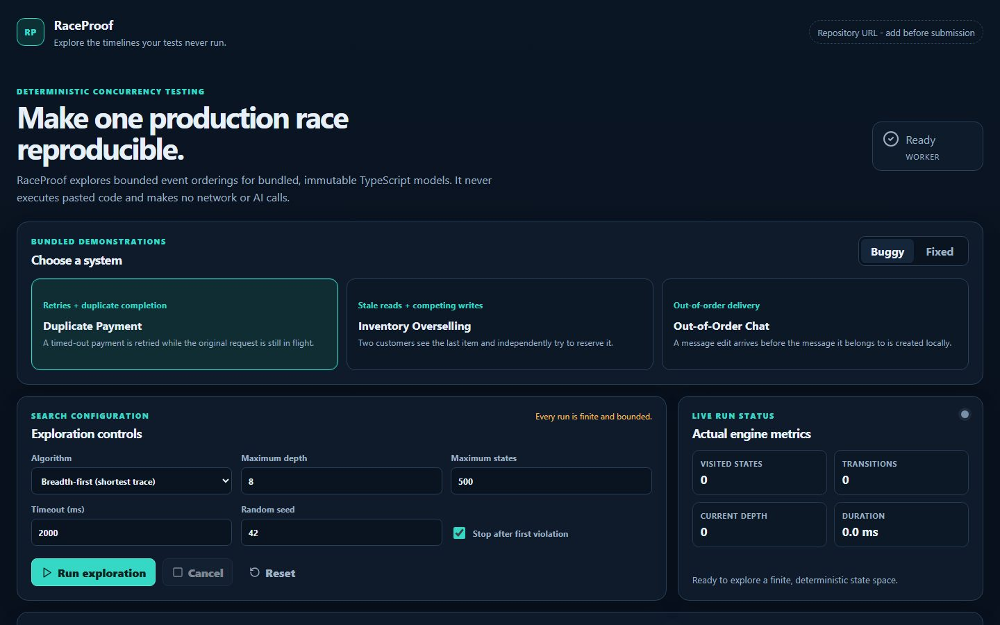
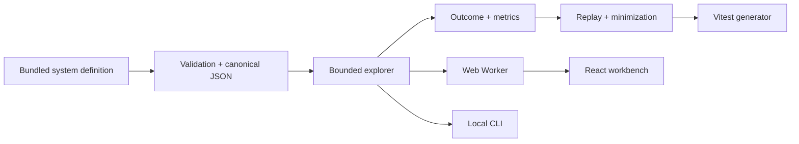

# RaceProof

**Explore the timelines your tests never run.**

RaceProof is a deterministic, bounded concurrency-testing tool for TypeScript. Describe JSON-compatible state, immutable transitions, guards, and safety invariants; RaceProof explores alternate event orders and returns a minimized, replayable counterexample when one breaks an invariant.

It runs entirely on your machine. There are no API keys, model calls, accounts, analytics, arbitrary-code editors, or paid services.



_The bundled Duplicate Payment scenario finds a real double-charge trace, then exposes each state change for replay and Vitest export._

[Download the voiceover-ready visual master (MP4)](docs/assets/raceproof-build-week-visual-master.mp4) | [Voiceover cues](docs/VOICEOVER_CUES.md) | [Captions (SRT)](docs/assets/raceproof-build-week-demo.srt)

## Why this exists

A conventional test usually commits to one schedule: request, response, assertion. Production systems see delayed originals, retries, duplicate delivery, stale reads, crashes, and out-of-order completion. A correct result in the expected schedule says little about the other reachable schedules.

RaceProof makes those schedules explicit. Its breadth-first explorer finds a shortest failing trace by default, then replay and delta debugging confirm the smallest valid reproduction it can derive. A bounded-safe result is reported precisely as **“No violation found within selected bounds.”** It is not an unbounded formal proof.

## Features

- Deterministic breadth-first, depth-first, and seeded randomized exploration
- Canonical state keys and duplicate-state elimination
- Strict bounds for depth, states, and wall-clock time
- Progress, cancellation, worker errors, and explicit completion reasons
- Mutation detection for transition inputs
- Counterexample reconstruction and guard-aware delta debugging
- Step replay with before/after JSON, field-level diffs, and invariant status
- Vitest regression-test generation, copy, and download
- Buggy and fixed payment, inventory, and chat demonstrations
- CLI with human-readable and JSON output
- Static React/Vite interface that performs all work locally in a Web Worker

## Architecture



See [docs/architecture.md](docs/architecture.md) for the decisions behind state identity, parent-linked traces, safe minimization, and bounded claims.

## Quick start

Requirements: Node.js 20 or newer and npm 10 or newer.

```sh
npm install
npm run dev
```

Open the local URL printed by Vite. Duplicate Payment / Buggy is selected for the shortest judge path.

## Web application

```sh
npm run dev       # local development server
npm run build     # static production bundle in apps/web/dist
```

The bundle is static and can be served by any static host. No server-side runtime is required.

## CLI

```sh
npm run raceproof -- payment --variant buggy
npm run raceproof -- payment --variant fixed
npm run raceproof -- inventory --max-depth 10
npm run raceproof -- chat --format json
```

Useful options include `--variant buggy|fixed`, `--algorithm bfs|dfs|random`, `--max-depth`, `--max-states`, `--timeout`, `--seed`, and `--format pretty|json`.

Exit codes:

- `0`: no violation found within the configured bounds
- `1`: an invariant violation was found
- `2`: invalid arguments, an invalid system, or an execution error

## Library example

```ts
import type { SystemDefinition } from '@raceproof/core';
import { explore, replayTrace } from '@raceproof/explorer';

type Counter = { value: number };

const system: SystemDefinition<Counter> = {
  id: 'counter',
  title: 'Counter',
  description: 'A small deterministic system',
  initialState: { value: 0 },
  transitions: [
    {
      id: 'increment',
      label: 'Increment',
      actor: 'worker',
      isEnabled: (state) => state.value < 2,
      apply: (state) => ({ ...state, value: state.value + 1 }),
    },
  ],
  invariants: [
    {
      id: 'bounded',
      title: 'Value stays bounded',
      description: 'The counter never exceeds one.',
      check: (state) => state.value <= 1,
    },
  ],
};

const result = await explore(system, {
  algorithm: 'bfs',
  maxDepth: 5,
  maxStates: 1_000,
  timeoutMs: 2_000,
  randomSeed: 42,
  stopOnFirstViolation: true,
});

if (result.counterexample) {
  replayTrace(system, result.counterexample.transitionIds);
}
```

## Testing and verification

```sh
npm run lint
npm run typecheck
npm run test
npm run test:coverage
npm run test:e2e       # requires a Playwright Chromium installation
npm run build
npm run benchmark
npm run check          # lint + typecheck + unit/integration tests + build
```

`npm run benchmark` reports measurements without applying machine-dependent pass/fail thresholds. The normal check intentionally does not install or run Playwright browsers.

## Included systems

| Example | Race exposed by the buggy variant | Fixed approach |
| --- | --- | --- |
| Duplicate Payment | timed-out original and retry both charge | idempotency record |
| Inventory Overselling | two stale reads reserve one item | atomic reservation |
| Out-of-Order Chat | an edit arrives before its message and is lost | buffer then reconcile |

## Supported platforms

- Current Chromium, Firefox, and WebKit-class browsers with Web Worker support
- Current desktop and mobile browsers; the interface is designed for ~390 px and wider
- Node.js 20+ on Windows, macOS, and Linux for CLI and tests

If a browser lacks Worker support, the UI uses a clearly reported local fallback. Very large bounds are rejected before execution.

## Limitations

- Exploration is finite and bounded; absence of a violation is not universal correctness.
- Only bundled, trusted TypeScript definitions run in the web release.
- State must be JSON-compatible and should remain compact; the visited-state map grows with unique states.
- Wall-clock timeouts are checked between deterministic transition operations, so one unusually expensive bundled transition cannot be preempted mid-call.
- Random exploration is pseudo-random and reproducible, not statistically exhaustive.
- RaceProof is a model-level testing tool, not production distributed tracing or a multi-language model checker.

## Security model

RaceProof does not evaluate pasted code or dynamically load modules from imported paths. Browser processing stays local, downloads use sanitized filenames, rendered data is text, and imported result data (where available) is size- and schema-limited. See [docs/security.md](docs/security.md).

## OpenAI Build Week

RaceProof was created for the Developer Tools track. GPT-5.6 and Codex assisted development, implementation, testing, and review; RaceProof itself contains no AI functionality and has no OpenAI runtime dependency. See [docs/CODEX_BUILD.md](docs/CODEX_BUILD.md), [docs/DEMO_SCRIPT.md](docs/DEMO_SCRIPT.md), and [docs/JUDGING_GUIDE.md](docs/JUDGING_GUIDE.md).

Before final Devpost submission, add the real main `/feedback` session ID in `docs/CODEX_BUILD.md` and a public demonstration-video URL in the Devpost form.

## Contributing

Contributions are welcome. Read [CONTRIBUTING.md](CONTRIBUTING.md) and [CODE_OF_CONDUCT.md](CODE_OF_CONDUCT.md) before opening a change.

## License

[MIT](LICENSE) © 2026 RaceProof contributors.
