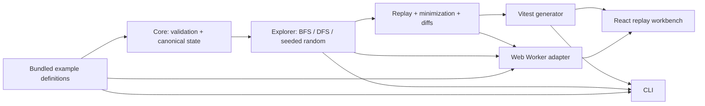

# Architecture

RaceProof is a local, deterministic state-space explorer. Bundled TypeScript definitions describe immutable state transitions and safety invariants; the same pure packages power the CLI, tests, and browser worker.

## Decisions

### JSON-compatible immutable state

Definitions use JSON-compatible object state. Canonical serialization recursively sorts object keys, giving content-addressed state keys independent of property insertion order. Development and test execution deep-clones and freezes transition inputs, then compares their canonical form after application to detect mutation.

### Pure engine with adapters

Exploration is an async pure-library operation with injected clock, cancellation signal, and progress callback. No browser or terminal primitive appears in the engine. A thin Worker protocol and a thin CLI adapter serialize the same results.

### Parent-linked visited graph

Visited nodes retain a state, depth, parent index, and incoming transition ID. This is enough to reconstruct counterexamples without storing a complete trace on every frontier entry. A deterministic map keyed by canonical state prevents duplicate expansion.

### Bounded outcomes, not proof claims

Completion is represented by explicit reasons: violation, exhausted-within-bounds, cancelled, max depth, state limit, timeout, or invalid system. Safe results always carry the exact checked bounds and use bounded language.

### Safe minimization

Delta debugging only accepts a candidate subsequence when replay confirms that every retained transition is enabled and the same invariant fails. Guard-invalid candidates are discarded. Original and minimized lengths are retained.

### Bundled trust boundary

The first release explores only statically bundled examples. The UI never executes imported code. Run-result JSON import/export is data-only, size-limited, and schema-validated. The static build has no backend and makes no API calls.

### Eventual chat invariant

The chat model includes an explicit `settle` transition. The invariant is evaluated at quiescence, so an edit arriving before creation is allowed temporarily but must be reflected once delivery has settled. This makes the liveness-like requirement testable as a bounded safety property.
